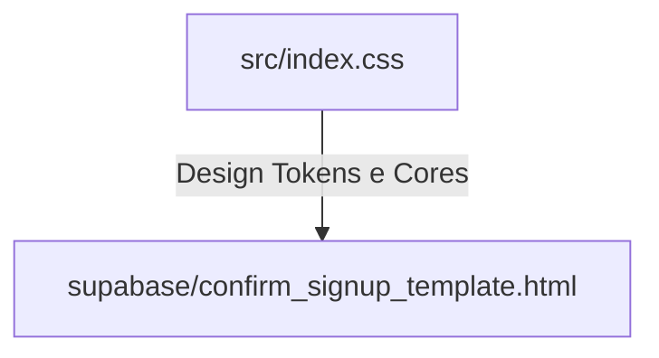

# Estrutura do Codebase & Dependências de Arquivo

Este documento detalha o mapa de dependências críticas do projeto **Help EAD**.

## 🗺️ Mapa de Dependências do Layout

O layout do sistema utiliza um design de tons azuis metálicos e cinza escuro. Os arquivos listados abaixo possuem dependências visuais diretas entre si. Qualquer alteração nos tokens de design deve ser sincronizada entre eles.

### Arquivos Relacionados:
1. **Design System**: [src/index.css](file:///c:/Projetos/MEGAsync/Projetos/gemini-cli/ead-help/src/index.css)
   * Define as variáveis CSS (`--color-brand-dark`, `--color-brand-medium`, `--color-brand-light`).
2. **Template de Confirmação de Cadastro**: [supabase/confirm_signup_template.html](file:///c:/Projetos/MEGAsync/Projetos/gemini-cli/ead-help/supabase/confirm_signup_template.html)
   * Utiliza as mesmas cores hexadecimais para garantir que a identidade do e-mail recebido pelo aluno corresponda perfeitamente ao layout do portal.

---

> [!WARNING]
> **Atenção:** Caso o tema/cores de [src/index.css](file:///c:/Projetos/MEGAsync/Projetos/gemini-cli/ead-help/src/index.css) sejam alterados, o template de e-mail em [supabase/confirm_signup_template.html](file:///c:/Projetos/MEGAsync/Projetos/gemini-cli/ead-help/supabase/confirm_signup_template.html) **deve ser atualizado** com as novas cores hexadecimais correspondentes, e re-enviado para o painel de configurações de Auth do Supabase.
